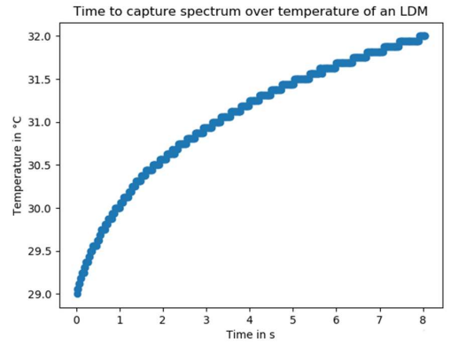

# Cold State Spectral Analysis using Oscilloscope, Function Generator, Spectrometer and LDM Module

## Description

Plichtpraktikum results for cold state measurements obtained for a laser detector module of a semiconductor laser of 910 nm wavelength with changes in various parameters like pulse repitition rate, trigger delay, integration time, pulse width etc.

## Usage

Obtains the spectrum from ThorLabs spectrometer in a cold state measurement from a laser, whose input parameters are:

- "freq" - Pulse Freq.: 10 Hz
- "charge_start" - pulse start time: 1 $\mu$ s
- "charge_stop" - pulse stop time: 1.25 $\mu$ s
- "trig_delay" - pulse delay time: 250 ns
- "trig_pulsewidth" - pulse width: 15 ns

### Setup

## Results

Initially, a single measurement of spectral centre of mass was obtained for cold state measurement while adjusting various parameters between oscilloscope, function generator and spectrometer.

Later, these spectral centre of mass results were plotted over a period of 8s with results spanning over 1000 - 1500 measurements while comparing them with that of the laser temperatures as shown in the result below.

Output was obtained in a .json along with a PNG in a folder. A plot was obtained between laser temperature and overall acquisition time.

A final comparision was made between the laser temperature over spectral center of mass. This is the final obtained result.

## Roadmap

## License

## Project Status
